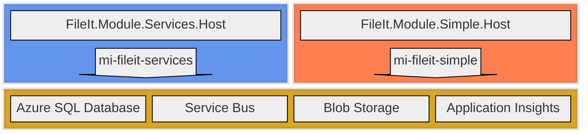

# cmeraz-fileit 
## Migrating a Windows service to Azure Service Bus

This repository illustrates with a working proof of concept how we might reshape a Windows service into Azure using native components that can be emulated in a local development environment. 

# Introduction

There’s an old Windows service in production that deserves more love than it is getting. It is well-architected, such that the business logic is nicely isolated. The service runs multiple workflows and each workflow is isolated and deployed separately. It is plug-in architecture. I really can’t complain about supporting a beautiful piece of software, but it is lacking in some areas.

# Problem Statement
Maintenance on this Windows service has been neglected such that its reliability is degraded, its manual processes of deployment and testing invite human error, and its technology lies out of reach of modern advantages for observability, security, and processing.

## Pain Points

### Deployment
Deployment is 100% manual. Sure, we run a pipeline to build the artifacts, but the existing installation folder is backed up manually, the artifacts are copied to the server manually, the installer is executed manually. When a plug-in is installed, its dll and config file are backed up from the installation folder and then the new files are copied to the installation folder manually.

### Unit tests 
There are none. This behemoth is over 40 kloc and most of it is dedicated to the mechanics of the service, its shared integrations, its scheduling. Most of this code is not business related and it feels like a waste of time to bother writing unit tests.

### Logging
Because this service has no companion UI, logs are our only view into its health and performance. The service takes care of all plug-in logging through a global variable with its own signature and it takes care of the sinks. I’d prefer the standard ILogger and utilize Serilog or NLog to manage the sinks. This would allow developers to not think about logging and do it frequently.

### Execution
Asynchronous method signatures would suit this kind of application perfectly, and this .NET Framework 4.8 app could have been written to take advantage of it, but the original authors may have found it unnecessary at the time. The consequences of that decision are evident: processes run long and are vulnerable to resource contention and exceptions. The service startup executes all plug-ins at once, an event that often prompts with error messages.

### Single repository
Each plug-in has its own repository. This makes it easy to dedicate a build pipeline for each plug-in, but it comes at a cost to overall maintenance. Since developers typically just open the plug-in solution, they aren’t aware of design patterns established in other repositories. The result is a hodge-podge of patterns that complicate refactoring efforts.

### Observability
Apart from the logging that we write to Event Viewer and to the database, we don’t have an in-depth view of the application’s health or an understanding of root cause when there’s a failure. In addition, to view the logs in either sink, we need an incident ticket and request an engineer to view the server logs and a DBA to view the database logs. This is more a complaint about how our own rules on accountability get in our way, but a rewrite of the service could include more thoughtful structures to help expedite RCA and eliminate obstacles.

### Reliability
As an on-prem solution, the organization is responsible for uptime, failover, backups, patching, and other measures to avoid disaster and risk to reputation. Needless to say, these measures have been neglected, technical debt has accrued, and everyone is hoping that a migration to the cloud will save them the trouble.

### Heavy loads
Big jobs are a frequent and embarrassing challenge for the application. It never scales to meet occasions of high demand and by funneling thousands of processes into a few APIs, it can choke at unpredictable times. In this case, its failure is its own doing; a better designed application could achieve load leveling and process API calls in an orderly fashion.

### Development setup
Developing for this application isn’t the easiest. Developers get latest on the service and the plug-in. They monkey with post-build events and application startup in order to replicate the service operation and debug the plug-in. Since service and plug-ins are separate repositories, the post-build event script forces developers to conform their local repositories. 

These are the main drivers for a rewrite, and many of these issues could be reduced or resolved by migrating the Windows service to the cloud, in our case Azure. But apart from spinning up an expensive VM in a lift-and-shift exercise, we could reshape the application to fit native components for a cheaper, serverless, low maintenance solution.

# Technical Requirements
The Windows service is a technology that strives to meet a business demand but not every aspect of a Windows service is a requirement. When trying to approximate the functionality that it offers, we should improve on technical decisions based on legacy limitations and extract what directly serves future use cases. For example, the Windows service logs to the server Event Viewer, which we no longer rely on when running in the cloud. 

## Execution Timing
* Batch processing is adequate, near-real time can be accommodated, but streaming or real-time is out of scope.

## Observability
* Traceability through all operations is imperative to finding root cause for failure.
* A centralized logging table is required for end-to-end traceability and monitoring trends across all workflows.

## Controls
* Ability to pause process for maintenance.
* Scale out in peak loads and load level to avoid API congestion downstream.
* Ability to retry or else park failed processes for review.

## Configuration
* host.json is for function settings
* appsettings.json is for non-sensitive application settings, specific to each module
* Application Settings in Azure Portal for connection strings, and values accessible both developers and engineers during runtime
* local.settings.json for these Application Settings in a non-Azure/local environment

## Structure
* Separate the application in the abstract from the infrastructure details, such that the path to changing cloud platform is well known and contained to specific areas.
* Each workflow should have a separate application boundary and each feature of that workflow should have a separate logical boundary.
* There must be clarity from each line of business on how failures should be treated, so that the application handles exceptions appropriately, however, a global strategy should exist to handle exceptions that otherwise evade capture.
* Each workflow should have its own core functionality – including an executable, configuration, dependency injection, and database access – to ensure independence.

## Testing
* Unit test projects serve multiple masters: enforcing architectural and functional requirements enforcement, ensuring quality, and acting as gatekeepers in the devops pipeline. Each project must have a companion unit test project that tests code in isolation, without downstream effects.
* Integration test projects automate complex use cases and should cover application projects.
Architecture test projects automate enforcement that project references maintain Clean Architecture standards.
* The solution must run and test in a local environment without depending on components in the cloud, except for APIs. Emulators, such as Azurite and the Service Bus emulator, should be preferred over connecting directly to cloud components.

## Network
* Assume the application executes in an internal hybrid network (on-prem and cloud), and needs ability to call external APIs via the public web.

## Security
* Encryption in transit and at rest.
* Move connection strings away from config files and into environment variables and go passwordless.

# Solution
To replace the legacy system, we use these native Azure components 
1. Flex Consumption tier Function Apps for application logic, each representing module boundaries
2. Blob Storage for file handling
3. Azure SQL Database for tracing requests
4. Service Bus for load leveling with queues and decoupling with topics
5. Application Insights for system observability
6. User defined managed identities for security

In addition to these cloud components, we prescribe these components for a local development environment:
1. .NET 10 (dotnet-isolated) function apps running locally with [Azure Functions Core Tools](https://github.com/Azure/azure-functions-core-tools)
2. SQL Server 2025 Developer Edition for [Windows](https://www.microsoft.com/en-us/sql-server/sql-server-downloads) or for [Linux](https://learn.microsoft.com/en-us/sql/linux/sql-server-linux-setup?view=sql-server-ver17)
3. Azurite to emulate Blob Storage. I use the [VS Code Extension](https://learn.microsoft.com/en-us/azure/storage/common/storage-install-azurite?tabs=visual-studio-code%2Cblob-storage) but you can install it [globally with npm](https://learn.microsoft.com/en-us/azure/storage/common/storage-install-azurite?tabs=npm%2Cblob-storage)
4. Service Bus Emulator running in [Docker](https://docs.docker.com/desktop/). The docker compose file is included in this repo under /emulator

These components simulate the complete Azure environment so that you can develop everything locally without a cloud-hosted dependency. 

# Next
- [Understand](./docs/architecture.md) the system design.
- [Signup](./docs/contribute.md) for hackathon and join my team.
- [Setup](./docs/local.md) an instance of this system on your local machine.
- [Provision](./docs/provisioning.md) this system to Azure following notes from my experience.
- [Digest](./docs/nomenclature.md) its naming conventions.
- [Extend](./docs/extensions.md) this system with a new Module.
- [Deploy](./docs/deployment.md) your new Module to Azure and sync database changes.

---

# My contributions (Xavier / Proximus)

Branch: `feature/gl-account-dataflow`

This fork extends Cesar's FileIt baseline with a full end-to-end implementation of the DataFlow module, a local Aspire orchestration layer, and observability wiring. The goal is a self-contained proof of concept that runs cold with a single `dotnet run` on a fresh clone, so the whole stack is demo-ready without requiring the rest of the team to have stood anything up.

## Issues addressed

### #24 - Load a CSV or JSON into a table, transform, and export to file

Built the DataFlow module end to end. A `GLAccount.csv` dropped into the `dataflow-source` blob container is picked up by `WatchInbound` (blob trigger), logged to the `DataFlowRequestLog` table in Azure SQL with a correlation ID, moved to `dataflow-working`, then a message is placed on the `dataflow-transform` service bus queue. `DataFlowSubscriber` picks up that message, downloads the blob, runs `TransformGlAccounts` (groups by COMPANYCODE + GLACCOUNTGROUP, counts rows, flags profit/loss vs balance sheet), writes the summary as `summary_GLAccount.csv` to `dataflow-final`, and updates the RequestLog row with rows-ingested, rows-transformed, and status=Complete. 24 groups produced from ~20k row test file.

### #19 - Test the Correlation ID

Correlation IDs now flow end to end across function invocations AND across the service bus hop: `WatchInbound` generates the ID, stores it on the RequestLog row, enqueues it in the transform message, `DataFlowSubscriber` receives it, and every log entry in every host for that CSV shares the same ID. Verified today by filtering Aspire's Structured view by a specific correlation ID and seeing the complete journey in one timeline.

### #25 - Message data

Service bus message payload for the DataFlow transform queue includes the correlation ID, blob name, and RequestLog ID. `BusTool` wraps the send/receive so the payload shape stays consistent across modules.

### #28 - Add Cancellation Tokens

Every async method in the DataFlow App layer (`IWatchInbound.RunAsync`, `ITransformGlAccounts.RunAsync`, `BlobTool` operations, `BusTool` operations) accepts a `CancellationToken` parameter wired through from the function invocation.

### #40 - New module generation

The DataFlow module was built from scratch following the pattern Cesar established with SimpleFlow, so the pattern for generating a new module is effectively documented by having a second worked example to diff against: Domain interfaces -> Infrastructure wiring -> App layer logic -> Host bindings -> Test scaffold.

### #20 - Improve the Docker experience

Fed back to Cesar directly: added `.gitattributes` rules for CRLF/LF consistency on docker compose and shell files, pinned the SQL Edge image to version 1.0.7 in compose to avoid ARM64 resolution on AMD64 VMs, and documented the WSL path for running from the solution root.

### #12 - Investigate Aspire

Full local orchestration via a new `FileIt.AppHost` project. One `dotnet run` spins up Azurite, all three function hosts in the correct order with `WaitFor` dependencies, injects the Azure SQL connection string from user secrets as `FileItDbConnection`, auto-creates all six blob containers (`dataflow-source`, `dataflow-working`, `dataflow-final`, `simple-source`, `simple-working`, `simple-final`), and exposes unified structured logs across all hosts in the Aspire dashboard.

Known officially assigned to Stas. I built this for my own learning and to have a standalone demo path. See [docs/ASPIRE.md](./docs/ASPIRE.md) for setup, gotchas, and what I learned.

### #39 - Production Cloud Readiness

In progress. Blob, Azure SQL, and function host pieces are wired for cloud deployment. Bicep IaC exists in the repo. Waiting on Finn for Service Bus RBAC grants to complete the cloud-ready pass.

## What's still open on this branch

- **Traces tab in Aspire** still empty. Structured logs via Serilog OTLP work, but distributed traces would require adding OpenTelemetry `ActivitySource` instrumentation to each function invocation. Medium effort, high demo payoff.
- **Service Bus emulator in AppHost** not yet wired, waiting on Finn for the cloud side. Locally the existing docker compose emulator still works alongside Aspire.
- **Lifecycle hook refactor** complete. AppHost now uses `builder.Eventing.Subscribe<AfterResourcesCreatedEvent>` instead of the initial `Task.Run` + delay hack.

## Why a separate branch

This is my contingency path. If the full team lands their pieces by the June deadline we merge forward. If not, this branch stands alone as a working demo.