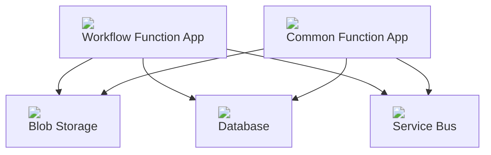
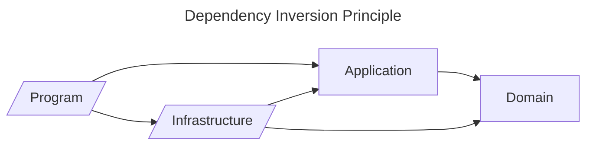
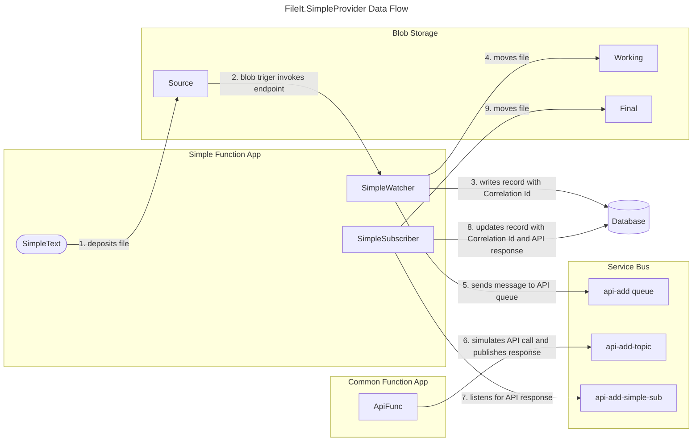

# cmeraz-fileit 
## Migrating a Windows service to Azure

# Introduction

There’s an old Windows service in production that needs a lot of love. It is well-architected, such that the business logic is nicely isolated. The service runs multiple workflows and each workflow is isolated and deployed separately. It is plug-in architecture. I really can’t complain about supporting a beautiful piece of software, but it is lacking in some areas.

This repository illustrates with a working proof of concept how we might migrate a Windows service to Azure using native components that can be emulated in a local development environment.

# Problem Statement
Maintenance on this Windows service has been neglected such that its reliability is degraded, its manual processes of deployment and testing invite human error, and its technology lies out of reach of modern advantages for observability, security, and processing.

## Pain Points

### Deployment
Deployment is 100% manual. Sure, we run a pipeline to build the artifacts, but the existing installation folder is backed up manually, the artifacts are copied to the server manually, the installer is executed manually. When a plug-in is installed, its dll and config file are backed up from the installation folder and then the new files are copied to the installation folder manually.

### Unit tests 
There are none. This behemoth is over 40 kloc and most of it is dedicated to the mechanics of the service, its shared integrations, its scheduling. Most of this code is not business related and it feels like a waste of time to bother writing unit tests.

### Logging
Because this service has no companion UI, logs are our only view into its health and performance. The service takes care of all plug-in logging through a global variable with its own signature and it takes care of the sinks. I’d prefer the standard ILogger and utilize Serilog or NLog to manage the sinks. This would allow developers to not think about logging and do it frequently.

### Execution
Asynchronous method signatures would suit this kind of application perfectly, and this .NET Framework 4.8 app could have been written to take advantage of it, but the original authors may have found it unnecessary at the time. The consequences of that decision are evident: processes run long and are vulnerable to resource contention and exceptions. The service startup executes all plug-ins at once, an event that often prompts with error messages.

### Single repository
Each plug-in has its own repository. This makes it easy to dedicate a build pipeline for each plug-in, but it comes at a cost to overall maintenance. Since developers typically just open the plug-in solution, they aren’t aware of design patterns established in other repositories. The result is a hodge-podge of patterns that complicate refactoring efforts.

### Encryption
The service and its plug-ins connect to an on-prem SQL Server 2019 database, which by default is not secure and requires certificates on the database server to encrypt the connection. They also connect to another database for downloading and running SSIS packages. In contrast, connections to current SQL Server databases, SQL MI and Azure SQL Database all offer TLS encrypted connections out of the box.

### Observability
Apart from the logging that we write to Event Viewer and to the database, we don’t have an in-depth view of the application’s health or an understanding of root cause when there’s a failure. In addition, to view the logs in either sink, we need an incident ticket and request an engineer to view the server logs and a DBA to view the database logs. This is more a complaint about how our own rules on accountability get in our way, but a rewrite of the service could include more thoughtful structures to help expedite RCA and eliminate obstacles.

### Reliability
As an on-prem solution, the organization is responsible for uptime, failover, backups, patching, and other measures to avoid disaster and risk to reputation. Needless to say, these measures have been neglected, technical debt has accrued, and everyone is hoping that a migration to the cloud will save them the trouble.

### Heavy loads
Big jobs are a frequent and embarrassing challenge for the application. It never scales to meet occasions of high demand and by funneling thousands of processes into a few APIs, it can choke at unpredictable times. In this case, its failure is its own doing; a better designed application could achieve load leveling and process API calls in an orderly fashion.

### Development setup
Developing for this application isn’t the easiest. Developers get latest on the service and the plug-in. They monkey with post-build events and application startup in order to replicate the service operation and debug the plug-in. Since service and plug-ins are separate repositories, the post-build event script forces developers to conform their local repositories. 

These are the main drivers for a rewrite, and many of these issues could be reduced or resolved by migrating the Windows service to the cloud, in our case Azure. But apart from spinning up an expensive VM in a lift-and-shift exercise, we could reshape the application to fit native components for a cheaper, serverless, low maintenance solution.

# Technical Requirements
The Windows service is a technology that strives to meet a business demand but not every aspect of a Windows service is a requirement. When trying to approximate the functionality that it offers, we should improve on technical decisions based on legacy limitations and extract what directly serves future use cases. For example, the Windows service logs to the server Event Viewer, which we no longer rely on when running in the cloud. 

## Execution Timing
* Batch processing is adequate, near-real time can be accommodated, but streaming or real-time is out of scope.

## Observability
* Traceability through all operations is imperative to finding root cause for failure.
* A centralized logging table is required for end-to-end traceability and monitoring trends across all workflows.

## Controls
* Ability to pause process for maintenance.
* Scale out in peak loads and load level to avoid API congestion downstream.
* Ability to retry or else park failed processes for review.

## Structure
* Separate the application in the abstract from the infrastructure details, such that the path to changing cloud platform is well known and contained to specific areas.
* Each workflow should have a separate application boundary and each feature of that workflow should have a separate logical boundary.
* There must be clarity from each line of business on how failures should be treated, so that the application handles exceptions appropriately, however, a global strategy should exist to handle exceptions that otherwise evade capture.
* Each workflow should have its own core functionality – including an executable, configuration, dependency injection, and database access – to ensure independence.

## Testing
* Unit test projects serve multiple masters: enforcing architectural and functional requirements enforcement, ensuring quality, and acting as gatekeepers in the devops pipeline. Each project must have a companion unit test project that tests code in isolation, without downstream effects.
* Integration test projects automate complex use cases and should cover application projects.
Architecture test projects automate enforcement that project references maintain Clean Architecture standards.
* The solution must run and test in a local environment without depending on components in the cloud, except for APIs. Emulators, such as Azurite and the Service Bus emulator, should be preferred over connecting directly to cloud components.

## Network
* Assume the application executes in an internal hybrid network (on-prem and cloud), and needs ability to call external APIs via the public web.

## Security
* Encryption in transit and at rest.
* Move connection strings away from config files and into environment variables.

# Design
## Architectural Design
In this diagram we see a workflow function app sharing resources with a common function app, so that the two function apps are decoupled. Additional workflows can be added to also leverage the functionality in the common function app. The function apps can manage files in the same storage, log to the same datatable and communicate via the service bus. Changes to a function app can be deployed separately from other function apps to maintain modularity. During peak loads, individual function apps can scale as needed.

Deployment can be automated, unit testing can be added to the pipeline, scaling can be parameterized and automated.

## Solution Design
The Program, in our case the Function App project, is responsible for gathering external resources (configuration, logging, database connections), including service collections, and preparing SDK clients for injection. The implementation for these services and clients is defined in the Infrastructure project. Both of these projects compile to assemblies that have dependencies on Azure SDKs, Serilog, Entity Framework, etc. In the event that we want to change cloud platforms, e.g. AWS, that would impact the Program and Infrastructure. Our Application and Domain libraries can remain as abstractions, untouched by changes to concrete details.

Each workflow resembles this basic solution design that follows the Dependency Inversion Principle:

- "High-level modules should not import anything from low-level modules. Both should depend on abstractions (e.g., interfaces)".
- "Abstractions should not depend on details. Details (concrete implementations) should depend on abstractions".

### Events and the Common Closure Principle
The Common Closure Principle states that classes that change for the same reasons and at the same times should be gathered into components, and classes that change at different times and for different reasons should be separated into different components (MARTIN, 2017).

Also known as the Single Responsibility Principle.

The SimpleEvents static class is a set of static fields representing loggable events using the EventId class. It _could_ be included in the Domain as a kind of value object, but its fields will grow as we refine the features of the Simple flow. As a new feature is added to the Simple flow, so must a field be added to the SimpleEvents class. As we reconceptualize and rename features, we must rename the fields. Therefore they change together; *each flow must have its Events class within its assembly*.

## Example Data Flow Diagram
This diagram tracks the flow of data as it passes through the workflow implemented by the FileIt.SimpleProvider example.

In this diagram, a timer trigger (1) causes SimpleTest to deposit a file in a blob storage container that sets in motion the workflow. Notice that no interaction exists between Simple Function App and Common Function App. The Service Bus facilitates a decoupling between application logic (5 and 7) and API communications (6). The use of a Correlation Id helps to gather all data about a particular workflow.

## Design Alternatives
1. If cloud resources are not available, the Service Bus component could be replaced with RabbitMQ and local directories could substitute Blob Storage.
2. If no message broker is possible, workflows could be implemented with a custom command line interface, though the application would no longer benefit from loose coupling.

# Local Setup
## Requirements
- Visual Studio or VS Code
- MSSQL (Developer edition is fine)
- Azurite (Blob Storage Emulator)
- Docker Desktop
- Service Bus Emulator
- Azure Function Core Tools
- .NET 8

## Installation and Execution
- Install MSSQL.
  - Create a FileIt database using the `scripts/misc/fileit.sql` SQL script.
  - Deploy tables using the dacpac produced by the SQL project
- Install Azurite using npm or the VS Code extension
- Install Docker Desktop
  - Edit the `emulator/config.json` with new queues or topics
  - Run the bash script `emulator/up.sh` to start up the emulator
  - Stop the emulator with `emulator/down.sh`
- Build the solution with `dotnet build`
- Run the solution
  - cd to app/
  - Run `func start`
  - The app/simple/SimpleTest.cs file contains a TimerTrigger that will deposit files in the source container that will trigger the Simple flow

#  Miscelaneous Ideas
BlobClient properties and Service Bus Messages both use Dictionary<string, string> which can be a Domain means for sharing blob identity, flow, state, and intended address

CorrelationId (correlation-id)	Enables an application to specify a context for the message for the purposes of correlation; for example, reflecting the MessageId of a message that is being replied to.

MessageId (message-id)	The message identifier is an application-defined value that uniquely identifies the message and its payload. The identifier is a free-form string and can reflect a GUID or an identifier derived from the application context. If enabled, the duplicate detection feature identifies and removes second and further submissions of messages with the same MessageId.

ReplyTo (reply-to)	This optional and application-defined value is a standard way to express a reply path to the receiver of the message. When a sender expects a reply, it sets the value to the absolute or relative path of the queue or topic it expects the reply to be sent to.

To (to)	This property is reserved for future use in routing scenarios and currently ignored by the broker itself. Applications can use this value in rule-driven autoforward chaining scenarios to indicate the intended logical destination of the message.

SequenceNumber	The sequence number is a unique 64-bit integer assigned to a message as it is accepted and stored by the broker and functions as its true identifier. For partitioned entities, the topmost 16 bits reflect the partition identifier. Sequence numbers monotonically increase and are gapless. They roll over to 0 when the 48-64 bit range is exhausted. This property is read-only.
