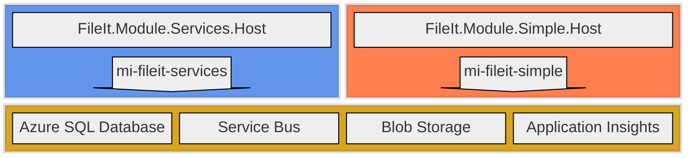

# cmeraz-fileit 
## Migrating a Windows service to Azure Service Bus

This repository illustrates with a working proof of concept how we might reshape a Windows service into Azure using native components that can be emulated in a local development environment. 

# Introduction

There’s an old Windows service in production that deserves more love than it is getting. It is well-architected, such that the business logic is nicely isolated. The service runs multiple workflows and each workflow is isolated and deployed separately. It is plug-in architecture. I really can’t complain about supporting a beautiful piece of software, but it is lacking in some areas.

# Problem Statement
Maintenance on this Windows service has been neglected such that its reliability is degraded, its manual processes of deployment and testing invite human error, and its technology lies out of reach of modern advantages for observability, security, and processing.

## Pain Points

### Deployment
Deployment is 100% manual. Sure, we run a pipeline to build the artifacts, but the existing installation folder is backed up manually, the artifacts are copied to the server manually, the installer is executed manually. When a plug-in is installed, its dll and config file are backed up from the installation folder and then the new files are copied to the installation folder manually.

### Unit tests 
There are none. This behemoth is over 40 kloc and most of it is dedicated to the mechanics of the service, its shared integrations, its scheduling. Most of this code is not business related and it feels like a waste of time to bother writing unit tests.

### Logging
Because this service has no companion UI, logs are our only view into its health and performance. The service takes care of all plug-in logging through a global variable with its own signature and it takes care of the sinks. I’d prefer the standard ILogger and utilize Serilog or NLog to manage the sinks. This would allow developers to not think about logging and do it frequently.

### Execution
Asynchronous method signatures would suit this kind of application perfectly, and this .NET Framework 4.8 app could have been written to take advantage of it, but the original authors may have found it unnecessary at the time. The consequences of that decision are evident: processes run long and are vulnerable to resource contention and exceptions. The service startup executes all plug-ins at once, an event that often prompts with error messages.

### Single repository
Each plug-in has its own repository. This makes it easy to dedicate a build pipeline for each plug-in, but it comes at a cost to overall maintenance. Since developers typically just open the plug-in solution, they aren’t aware of design patterns established in other repositories. The result is a hodge-podge of patterns that complicate refactoring efforts.

### Observability
Apart from the logging that we write to Event Viewer and to the database, we don’t have an in-depth view of the application’s health or an understanding of root cause when there’s a failure. In addition, to view the logs in either sink, we need an incident ticket and request an engineer to view the server logs and a DBA to view the database logs. This is more a complaint about how our own rules on accountability get in our way, but a rewrite of the service could include more thoughtful structures to help expedite RCA and eliminate obstacles.

### Reliability
As an on-prem solution, the organization is responsible for uptime, failover, backups, patching, and other measures to avoid disaster and risk to reputation. Needless to say, these measures have been neglected, technical debt has accrued, and everyone is hoping that a migration to the cloud will save them the trouble.

### Heavy loads
Big jobs are a frequent and embarrassing challenge for the application. It never scales to meet occasions of high demand and by funneling thousands of processes into a few APIs, it can choke at unpredictable times. In this case, its failure is its own doing; a better designed application could achieve load leveling and process API calls in an orderly fashion.

### Development setup
Developing for this application isn’t the easiest. Developers get latest on the service and the plug-in. They monkey with post-build events and application startup in order to replicate the service operation and debug the plug-in. Since service and plug-ins are separate repositories, the post-build event script forces developers to conform their local repositories. 

These are the main drivers for a rewrite, and many of these issues could be reduced or resolved by migrating the Windows service to the cloud, in our case Azure. But apart from spinning up an expensive VM in a lift-and-shift exercise, we could reshape the application to fit native components for a cheaper, serverless, low maintenance solution.

# Technical Requirements
The Windows service is a technology that strives to meet a business demand but not every aspect of a Windows service is a requirement. When trying to approximate the functionality that it offers, we should improve on technical decisions based on legacy limitations and extract what directly serves future use cases. For example, the Windows service logs to the server Event Viewer, which we no longer rely on when running in the cloud. 

## Execution Timing
* Batch processing is adequate, near-real time can be accommodated, but streaming or real-time is out of scope.

## Observability
* Traceability through all operations is imperative to finding root cause for failure.
* A centralized logging table is required for end-to-end traceability and monitoring trends across all workflows.

## Controls
* Ability to pause process for maintenance.
* Scale out in peak loads and load level to avoid API congestion downstream.
* Ability to retry or else park failed processes for review.

## Configuration
* host.json is for function settings
* appsettings.json is for non-sensitive application settings, specific to each module
* Application Settings in Azure Portal for connection strings, and values accessible both developers and engineers during runtime
* local.settings.json for these Application Settings in a non-Azure/local environment

## Structure
* Separate the application in the abstract from the infrastructure details, such that the path to changing cloud platform is well known and contained to specific areas.
* Each workflow should have a separate application boundary and each feature of that workflow should have a separate logical boundary.
* There must be clarity from each line of business on how failures should be treated, so that the application handles exceptions appropriately, however, a global strategy should exist to handle exceptions that otherwise evade capture.
* Each workflow should have its own core functionality – including an executable, configuration, dependency injection, and database access – to ensure independence.

## Testing
* Unit test projects serve multiple masters: enforcing architectural and functional requirements enforcement, ensuring quality, and acting as gatekeepers in the devops pipeline. Each project must have a companion unit test project that tests code in isolation, without downstream effects.
* Integration test projects automate complex use cases and should cover application projects.
Architecture test projects automate enforcement that project references maintain Clean Architecture standards.
* The solution must run and test in a local environment without depending on components in the cloud, except for APIs. Emulators, such as Azurite and the Service Bus emulator, should be preferred over connecting directly to cloud components.

## Network
* Assume the application executes in an internal hybrid network (on-prem and cloud), and needs ability to call external APIs via the public web.

## Security
* Encryption in transit and at rest.
* Move connection strings away from config files and into environment variables and go passwordless.

# Solution
To replace the legacy system, we use these native Azure components 
1. Flex Consumption tier Function Apps for application logic, each representing module boundaries
2. Blob Storage for file handling
3. Azure SQL Database for tracing requests
4. Service Bus for load leveling with queues and decoupling with topics
5. Application Insights for system observability
6. User defined managed identities for security

In addition to these cloud components, we prescribe these components for a local development environment:
1. .NET 10 (dotnet-isolated) function apps running locally with [Azure Functions Core Tools](https://github.com/Azure/azure-functions-core-tools)
2. SQL Server 2025 Developer Edition for [Windows](https://www.microsoft.com/en-us/sql-server/sql-server-downloads) or for [Linux](https://learn.microsoft.com/en-us/sql/linux/sql-server-linux-setup?view=sql-server-ver17)
3. Azurite to emulate Blob Storage. I use the [VS Code Extension](https://learn.microsoft.com/en-us/azure/storage/common/storage-install-azurite?tabs=visual-studio-code%2Cblob-storage) but you can install it [globally with npm](https://learn.microsoft.com/en-us/azure/storage/common/storage-install-azurite?tabs=npm%2Cblob-storage)
4. Service Bus Emulator running in [Docker](https://docs.docker.com/desktop/). The docker compose file is included in this repo under /emulator

These components simulate the complete Azure environment so that you can develop everything locally without a cloud-hosted dependency. 

# Next
- [Understand](./docs/architecture.md) the system design.
- [Signup](./docs/contribute.md) for hackathon and join my team.
- [Setup](./docs/local.md) an instance of this system on your local machine.
- [Provision](./docs/provisioning.md) this system to Azure following notes from my experience.
- [Digest](./docs/nomenclature.md) its naming conventions.
- [Extend](./docs/extensions.md) this system with a new Module.
- [Deploy](./docs/deployment.md) your new Module to Azure and sync database changes.

---

# My contributions (Xavier / Proximus)

Branch: `feature/gl-account-dataflow`

This fork extends Cesar's FileIt baseline into a full end-to-end demonstrable system. Of 32 mirrored issues, 23 are closed with code, tests, and documentation. The goal is a self-contained proof of concept that runs cold with a single `dotnet run` on a fresh clone and exercises real cloud Azure Service Bus and Azure SQL, not just emulators.

Issue numbers below refer to issues in this fork (`Pr0x1mo/cmeraz-fileit`), which mirror the originals from `cesarmeraz/cmeraz-fileit` for solo ownership tracking.

## Closed issues (23 of 32)

### #1 - Investigate Aspire

Full local orchestration via `FileIt.AppHost`. One `dotnet run` spins up Azurite, all four function hosts (Services, SimpleFlow, DataFlow, Complex) in the correct order with `WaitFor` dependencies, injects connection strings from user secrets, auto-creates all six blob containers, and exposes unified structured logs across all hosts in the Aspire dashboard. Uses the Aspire eventing API (`builder.Eventing.Subscribe<AfterResourcesCreatedEvent>`) rather than the initial `Task.Run` plus delay hack.

### #3 - Establish a database deployment strategy

DACPAC-based deployment via `scripts/deploy-database.ps1` wrapping sqlpackage, idempotent, deploy report against live FileIt on jmplabsv04 shows empty Operations after final publish. Re-running publish is a no-op. CHECK constraint authoring rule documented (must be OR chains, not IN-lists).

### #4 - Unit test FileIt.Module.Services.App

6/6 MSTest cases on ApiAddCommand: happy-path Complex bridge, null CorrelationId fallback, ComplexApiUnavailableException bubbles unhandled (broker retries), audit row and broadcaster skipped when Complex fails, OperationCanceledException propagation, CorrelationId passed through as Idempotency-Key.

### #5 - Unit test FileIt.Module.SimpleFlow.App

10/10 MSTest cases across `BasicApiAddHandler` and `WatchInbound`: move-and-stamp happy path, missing SimpleRequestLog throws, missing BlobName throws, no-op on missing record, OperationCanceledException, null CorrelationId fallback, full add-move-send pipeline, cancellation between AddAsync and MoveAsync, unique MessageId per call, ApiAddPayload.FileName matches blob name.

### #9 - Improve the docker experience

Cleanup of docker-compose, gitattributes for CRLF/LF consistency, pinned SQL Edge image to 1.0.7 to avoid ARM64 resolution on AMD64 VMs.

### #10 - Simulate a more complex API

Full Complex module: Domain interfaces, Infrastructure repos and HTTP client, `FileIt.Module.Complex.App` with chaos/latency/idempotency behaviors, `FileIt.Module.Complex.Host` exposing REST endpoints (POST/GET/DELETE/Export), Tests, Integration. Schema deployed via DACPAC (`ComplexDocument`, `ComplexIdempotency`). Services-host's `ApiAddCommand` now calls Complex over HTTP via `IComplexApiClient` instead of returning `"Imaginary"`. AppHost orchestrates `complex-host` alongside the other hosts. New `ApiAddTestProducer` HTTP trigger at `POST /api/test/api-add` publishes real Service Bus messages to the cloud `sbus-pe-2d99722c9843d8` namespace. Validated end-to-end with five consecutive matching `ComplexDocument` and `ApiLog` rows, including the exact correlationId from the test curl.

### #11 - Architectural unit tests

New `FileIt.Architecture.Test` project with 16 NetArchTest rules, 16/16 passing. Coverage: dependency direction (Domain has zero dependencies, stays POCO), module isolation (Apps reference Domain only, Hosts do not reference each other), naming (public types under declared namespace, .Commands/.Queries suffix convention, public interfaces start with I), runtime (no Azure SDK or EF in App layer, no async void outside event handlers). Caught and fixed a real layering violation: 5 SimpleFlow.Host classes lived in `FileIt.Module.SimpleFlow` instead of `FileIt.Module.SimpleFlow.Host`. Also cleaned dead `IAzureClientFactory<ServiceBusSender>` injection from `ApiAddCommand`. Closes both #11 and #19 (duplicate).

### #12 - Determine response to dead letters

Initial design phase, fed into the #22 implementation.

### #13 - Load a CSV or JSON into a table, transform, and export to file

DataFlow module end-to-end. `GLAccount.csv` dropped in `dataflow-source` is picked up by `WatchInbound`, logged to `DataFlowRequestLog` with a correlation ID, moved to `dataflow-working`, message placed on the `dataflow-transform` service bus queue. `DataFlowSubscriber` picks up, runs `TransformGlAccounts` (groups by COMPANYCODE plus GLACCOUNTGROUP, counts rows, flags profit/loss vs balance sheet), writes `summary_GLAccount.csv` to `dataflow-final`, updates the RequestLog row with rows-ingested, rows-transformed, status=Complete. 24 groups produced from ~20k row test file.

### #15 - Add Cancellation Tokens

Every async method across all four modules accepts a `CancellationToken` parameter wired through from the function invocation. Function host triggers, command handlers, repos, blob operations, service bus operations.

### #17 - Migrate from .NET 8 to 10

Solution targets net10.0 in all csproj files.

### #19 - Test the Correlation ID

Closed as duplicate of #11 (architectural verification handled there).

### #20 - Migrate IBroadcastResponses from Domain to Common

Solution structure follows the App / Host / Test convention with proper interface placement.

### #21 - Refine the project naming convention

Project structure follows `FileIt.Module.Name.Host` / `App` / `Test` taxonomy.

### #22 - Move hardcoded paths in scripts to environment variables

Scripts use environment variables and forward slashes per the convention.

### #22 (mirror of original #35) - Dead-letter strategy end-to-end

Production-grade dead-letter pipeline. `ExceptionHandlingMiddleware` was swallowing non-HTTP exceptions and breaking retries, fixed to rethrow. New `dbo.DeadLetterRecord` table (24 columns, 6 indexes), `DeadLetterClassifier`, `DeadLetterRecord` entity and repo with DbContext mapping, EventId 70 added for `UnhandledException`. Every publish now stamps `X-FileIt-EnqueuedTimeUtc` as a service bus app property. HTTP replay endpoint at `POST /api/deadletter/{id:long}/replay`. `FailureCategory` enum lives in Domain layer.

### #23 - Rename Database project and folder

Folder is named `FileIt.Database` in this fork.

### #24 - New module generation

`dotnet new` template at `templates/FileIt.Module/` plus `scripts/new-fileit-module.ps1` wrapper. PascalCase validation, EventId auto-allocation from 4000+, HTTP port auto-allocation from 7063+, automatic .sln registration. Verified end-to-end against scaffolded DemoModule: scaffold creates 4 projects, registers in `FileIt.All.sln`, `dotnet build` succeeds. Remove undoes everything cleanly. This is why adding the Complex module in #10 went smoothly: the generator scaffolded all four projects.

### #26 - CommonLog queries and review

`EventName` column added (nvarchar(100) NULL with filtered index), Properties fix in `DatabaseSink`, 8 reusable queries in `docs/queries/commonlog/`, schema review docs.

### #28 - Log file review

Rich shareable log files per host for dev/QA/UAT environments.

### #29 - Seek no-code filtering on blob containers

Determined that no-code blob filtering is not viable. Filtering handled in C# instead.

### #30 - Prune extra project referenced packages

Package references pruned across the solution.

### #31 - Remove references to MSTest

(All test projects standardized; some Test projects retain MSTest with `Assert.ThrowsAsync<T>` for the newer MSTest 4.x API.)

### #32 - Include EventId Name in logs

EventId Name implemented in commit 2eacab6, surfaced in CommonLog `EventName` column for human-readable filtering.

## What's open

- **#6 Unit test FileIt.Infrastructure.** ~10 classes to cover (ApiLogRepo, SimpleRequestLogRepo, DataFlowRequestLogRepo, DeadLetterRecordRepo, BlobTool, BusTool, PublishTool, DeadLetterClassifier, DeadLetterIngestionService, DeadLetterReplayService).
- **#14 Message data standards.** Doc-only; the patterns we already use (ApiRequest contract with CorrelationId/MessageId/ReplyTo/Subject, idempotency-via-correlation) need a written spec.
- **#16 Fix FileIt.Infrastructure.Integration tests.** Currently broken on `DbConnectionString missing`; config naming or test-host wiring issue.

## Cloud-blocked, waiting on Finn for lab-35 provisioning

#2 (deployment scripts), #7 (UI prototype), #18 (cloud readiness review), #25 (App Insights queries and dashboard), #27 (testability readiness review).

## Architecture and operational notes

The system runs against the real cloud Service Bus namespace `sbus-pe-2d99722c9843d8` in lab-35, not just a local emulator. Function apps in lab-34 (fa-fileit34-services, fa-fileit34-simple, fa-fileit34-complex) consume from those queues. Azure SQL stays in lab-35 (`jmplabsv04 / FileIt`).

The cloud cutover validated end-to-end: a curl to `POST /api/test/api-add` publishes a real Service Bus message to lab-35, services-host triggers, calls Complex over HTTP, Complex inserts a row in `dbo.ComplexDocument`, ApiLog gets stamped with `Complex:<guid>`. Five consecutive matching rows in the database including the exact correlationId from the test curl.

## Why a separate branch

If the full team lands their pieces by the June deadline we merge forward. If not, this branch stands alone as a working demo.