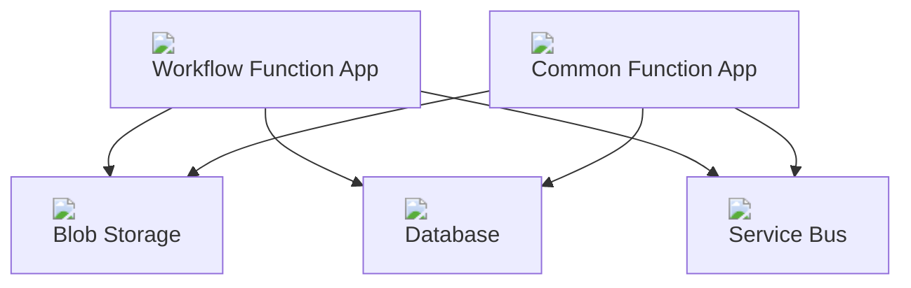
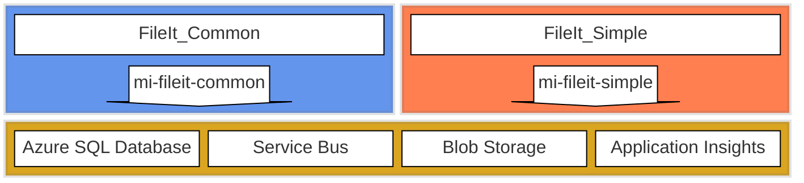
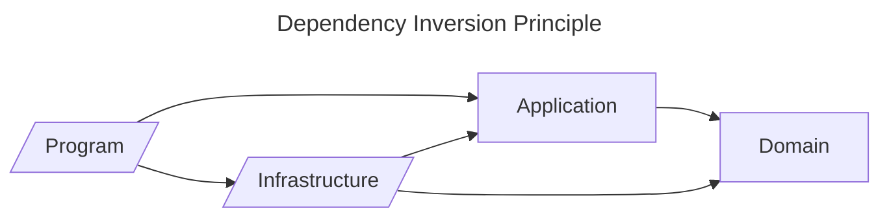
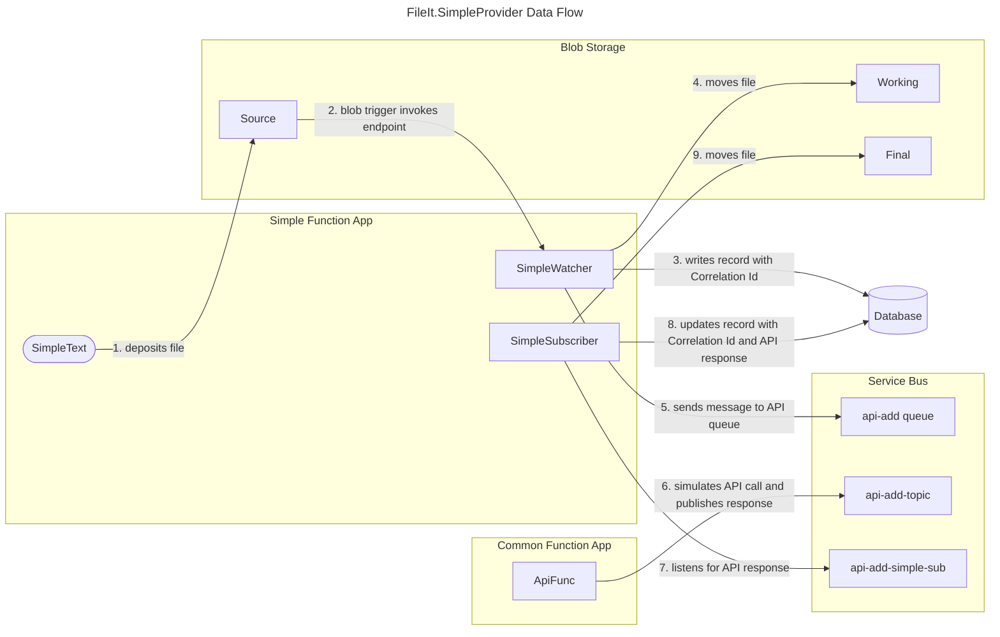

# Design
## Architectural Design
In this diagram we see a workflow function app sharing resources with a common function app, so that the two function apps are decoupled. Additional workflows can be added to also leverage the functionality in the common function app. The function apps can manage files in the same storage, log to the same datatable and communicate via the service bus. Changes to a function app can be deployed separately from other function apps to maintain modularity. During peak loads, individual function apps can scale as needed.

Deployment can be automated, unit testing can be added to the pipeline, scaling can be parameterized and automated.

Since implementing this solution and successfully publishing to Azure, I have to amend this diagram to include a few extra resources. 
1. Recognizing that the iterative development process would be easier if I didn't have to recreate sql users and roles for system defined managed identities, I converted them to user defined managed identities.
2. When publishing the Function Apps to Flex Consumption tier instances, I learned of its unique deployment constraint and it forced me to consider all generation of Application Settings, including Application Insights connection values.
Here's a different take on the architecture, with these additions:

## Solution Design
The Program, in our case the Function App project, is responsible for gathering external resources (configuration, logging, database connections), including service collections, and preparing SDK clients for injection. The implementation for these services and clients is defined in the Infrastructure project. Both of these projects compile to assemblies that have dependencies on Azure SDKs, Serilog, Entity Framework, etc. In the event that we want to change cloud platforms, e.g. AWS, that would impact the Program and Infrastructure. Our Application and Domain libraries can remain as abstractions, untouched by changes to concrete details.

Each workflow resembles this basic solution design that follows the Dependency Inversion Principle:

- "High-level modules should not import anything from low-level modules. Both should depend on abstractions (e.g., interfaces)".
- "Abstractions should not depend on details. Details (concrete implementations) should depend on abstractions".

### Events and the Common Closure Principle
The Common Closure Principle states that classes that change for the same reasons and at the same times should be gathered into components, and classes that change at different times and for different reasons should be separated into different components (MARTIN, 2017).

Also known as the Single Responsibility Principle.

The SimpleEvents static class is a set of static fields representing loggable events using the EventId class. It _could_ be included in the Domain as a kind of value object, but its fields will grow as we refine the features of the Simple flow. As a new feature is added to the Simple flow, so must a field be added to the SimpleEvents class. As we reconceptualize and rename features, we must rename the fields. Therefore they change together; *each flow must have its Events class within its assembly*.

## Example Data Flow Diagram
This diagram tracks the flow of data as it passes through the workflow implemented by the FileIt.SimpleProvider example.

In this diagram, a timer trigger (1) causes SimpleTest to deposit a file in a blob storage container that sets in motion the workflow. Notice that no interaction exists between Simple Function App and Common Function App. The Service Bus facilitates a decoupling between application logic (5 and 7) and API communications (6). The use of a Correlation Id helps to gather all data about a particular workflow.

## Design Alternatives
1. If cloud resources are not available, the Service Bus component could be replaced with RabbitMQ and local directories could substitute Blob Storage.
2. If no message broker is possible, workflows could be implemented with a custom command line interface, though the application would no longer benefit from loose coupling.
