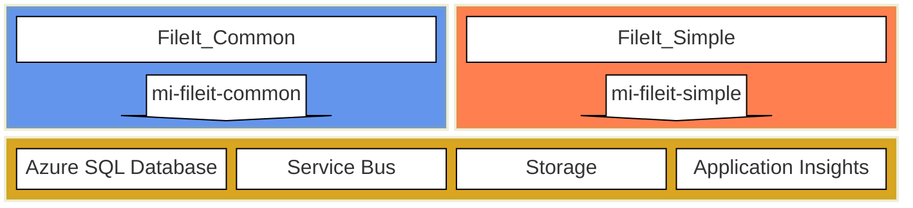

```mermaid
block
  columns 4
    block:groupA:2
      columns 1
      FA1["FileIt_Common"] 
      MI1<["mi-fileit-common"]>(down) 
      end
    block:groupB:2
      columns 1
      FA2["FileIt_Simple"] 
      MA2<["mi-fileit-simple"]>(down) 
    end
  block:group3:4
    DB["Azure SQL Database"] 
    S["Service Bus"] 
    ST["Storage"] 
    AI["Application Insights"]
  end
  style FA1 fill:white,color:#636, stroke-width:1px, stroke:black 
  style MI1 fill:white,color:#636, stroke-width:1px, stroke:black
  style MA2 fill:white,color:#636, stroke-width:1px, stroke:black
  style DB fill:white,color:#636, stroke-width:1px, stroke:black
  style FA2 fill:white,color:#636, stroke-width:1px, stroke:black
  style MI1 fill:white,color:#636, stroke-width:1px, stroke:black
  style S fill:white,color:#636, stroke-width:1px, stroke:black
  style ST fill:white,color:#636, stroke-width:1px, stroke:black
  style AI fill:white,color:#636, stroke-width:1px, stroke:black
  style groupA fill:cornflowerblue,stroke-width:4px
  style groupB fill:coral,stroke-width:4px
  style group3 fill:goldenrod,stroke-width:4px
```